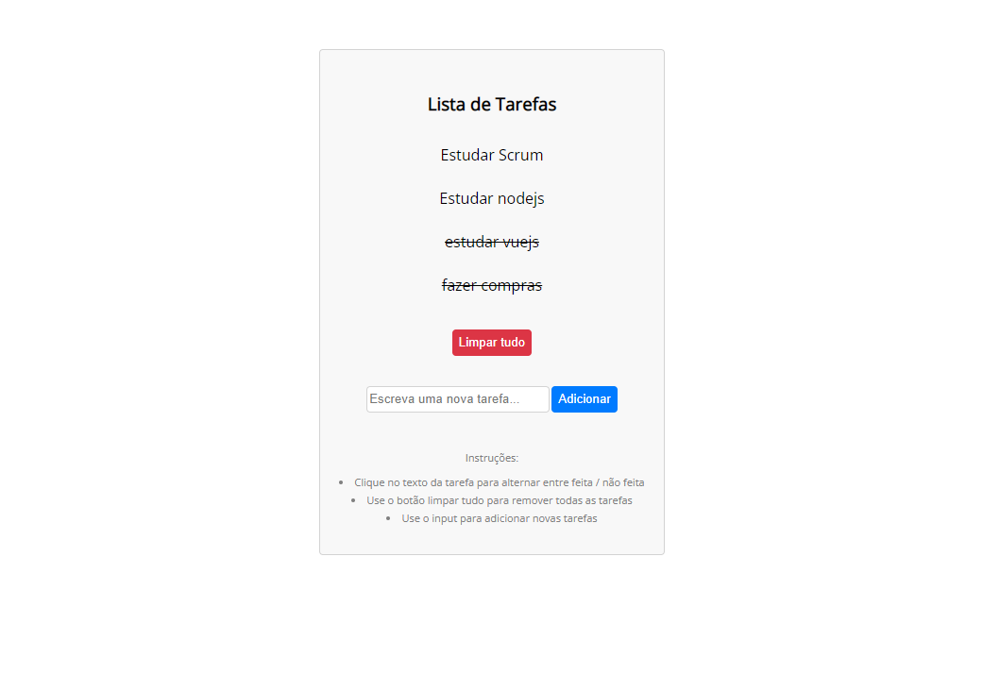

# To-do List

### Desafio para implementar funcionabilidades de um To-do list utilizando VueJs

 

#### Implementação do desafio:
- Adicionar uma nova tarefa [✅]
- Marcar como concluido [✅]

#### Implementação adicional:
- Persistência dos dados no localStorage [✅]

#### Resultado:
